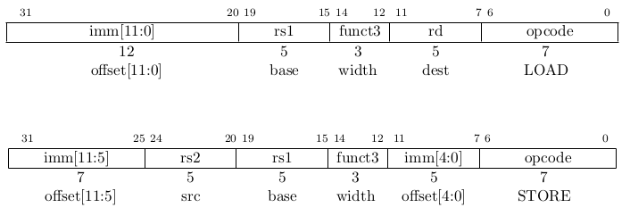

# Návrh jádra procesoru architektury RISC-V v FPGA

## Zadání
![[BP_Jaroslav_Korner/RISC-V/Zadání Bakalářské práce|Zadání]]

## Předmluva
Jistě se ptáte, co stálo za mým rozhodnutím zvolit si za téma mé bakalářské práce návrh vlastního procesoru?

Již na středí škole ve mě vzbudil velký zájem předmět číslicové technologie a vše s ním spojené. Když jsem poprvé za sebe zapojil čtyři čtyřbitové čítače nahoru [7493](https://cs.wikipedia.org/wiki/Seznam_logických_integrovaných_obvodů_řady_7400) s adekvátním modulem 24,10,6,10. Čtyři dekodéry na 7-segment 7449 a za ně odpory a displeje. Tuto hromadu švábů a propojovacích vodičů jsem napojil na generátor hodinového signálů (přepokládám značky Tesla) a před mým zrakem se rozeběhly číslíčka primitivních digitálních hodin. V tu chvíli se mi rozzářily oči a já měl pocit jako že jsem právě v tom okamžiku ovládl tranzistory a elektrický proud.

Netrvalo to dlouho a naskytla se mi příležitost rozebrat svůj první stolní počítač (těmito slovy myslím kamarádův). Vypojil jsem ho ze zásuvky a s křížovým šroubovákem v jedné ruce jsem hbitě postupoval skříní k jeho niternějším a niternějším útrobám. Nakonec již nezbylo nic co bych mohl z šasi vyjmout. Rozprostíral se zde přede mnou na kuchyňském linoleu úplně nový svět. Svět plný prapodivných součástek a elektroniky, které bych si dříve nedovedl představit ani v těch nejdivočejších snech. Při kompletaci jsem pokračoval v opačném pořadí než při demontáží a když má práce ustala, stál zde opět více méně, až na pár šroubků, ten původní počítač. Stačilo ho už jen zapnout. Mé srdce se rozbušilo. Spatřil jsem však ještě jedno tlačítko vzadu na zdroji počítače, které jsem řádně neprozkoumal. Věděl jsem že musím stůj co stůj přijít na to co se stane když ho přepnu. Učinil jsem tak a ozvala se rána jako když střelí z děla a z útrob počítače se vyvalil začernalý obláček dýmu. 

V tu chvíli jsem měl jasno. Ten den na tom místě jsem se zapřísáhl že neustanu ve svém bádání, dokud neodhalím všechny kouzla, čáry a taje, které v sobě počítačová skříň skrývá. 

Tyto a další události vedli k tomu, že dnes stojím právě zde a jsem rozhodnut navrhnout si svůj vlastní procesor. 

## Abstract
This bachelor thesis deals with the design of a single-core processor of the RISC-V32I architecture, i.e. a processor with 32-bit memory addressing and working over the integer data type. The design was limited to the unprivileged instruction set.
The processor core is designed in the VHDL language. This design was then tested using simulation in the Xilinx Vivado environment. The overall functionality is demonstrated by a simple demonstration program running on the Avnet ZedBoard.

### Keywords
bachelor thesis, 32-bit microprocessor, RISC-V32I instruction set architecture, hardware design in VHDL, field programmable gate array

## Abstrakt
Tato bakalářská práce se zabývá návrhem jedno jádrového procesor architektury RISC-V32I, tedy procesoru s 32 bitovou adresací paměti a pracující nad datovým typem integer. Návrh byl omezen na neprivilegovaný instrukční soubor. 
Jádro procesoru je navrženo v jazyce VHDL. Tento návrh byl následně otestován pomocí simulace v prostředí Xilinx Vivado. Celková funkčnost je předvedena jednoduchým demonstračním programem spuštěným na desce Avnet ZedBoard.

### Klíčová slova
bakalářská práce, 32-bitový mikroprocesor, architektura instrukčního souboru RISC-V32I, návrh hardwaru v jazyce VHDL, programovatelné hradlové pole

## Seznam zkratek
[RISC-V](https://codasip.com/2021/03/17/what-does-risc-v-stand-for/)
| Zkratka | Význam                                                           |
| ------- | ---------------------------------------------------------------- |
| ALU     | Aritmeticko-Logická Jednotka                                     |
| ARM     | Advanced RISC Machine / Acorn RISC Machine                       |
| AXI     | Advanced eXtensible Interface                                    |
| CISC    | Complex Instruction Set Computer                                 |
| CPU     | Central Processing Unit                                          |
| CU      | Control Unit                                                     |
| DSP     | digital signal procesing                                         |
| FPGA    | Field Programmable Gate Array                                    |
| GNU     | GNU's Not Unix!                                                  |
| HW      | Hardware                                                         |
| IDE     | integrated development environment                               |
| ISA     | Instruction Set Architecture                                     |
| LUT     | look up table                                                    |
| MMAP    | memory mapped device                                             |
| PC      | Program Counter                                                  |
| RISC    | Reduced Instruction Set Computer                                 |
| RISC-V  | Reduced Instruction Set Computer - Version 5 (čti: risk pět)     |
| SW      | Software                                                         |
| SoC     | systém na čipu                                                   |
| VHDL    | Very High Speed Integrated Circuit Hardware Description Language |
| WSL     | Windows Subsystem for Linux                                      |
| XLEN    | délka registrů procesoru (32b)                                   |
| XPM     | Xilinx Parameterized Macros                                      |
| ce      | clock enable                                                     |
| rd      | Register Destination                                             |
| rs1     | Register Source 1                                                |
| rs2     | Register Source 2                                                |

SSI small scale integration

## Úvod
Tato bakalářská práce se zabývá vytvořením návrhu procesoru RISC-V32I v jazyce VHDL. Jedním ze základních úkolů této bakalářské práce je seznámení se podrobněji architekturou procesorů RISC-V. 

Úkolem této bakalářské práce je navrhnout procesor s jedním jádrem, který je vybaven 32 bitovou adresní sběrnicí. Jehož aritmetickologická jednotka musí umožňovat sčítání, odčítání a všechny základní operace booleovské algebry nad celými čísly. Tento návrh se nezabývá výpočty nad čísly s plovoucí řádovou čárkou, ani operacemi privilegovaného instrukčního souboru. 
Jednotlivé část návrhu procesoru budou otestovány simulací v prostředí Xilinx Vivado. Po té co bude plně navržen, projde všemi simulacemi a úspěšnou syntézou, tak dojde k jeho nahání na vývojovou desku Avnet ZedBoard. Zde na něm bude ověřena jeho funkčnost pomocí demonstračního programu, jenž otestuje procesor při ovládaní vstupních a výstupních periferií. 

První kapitola "důležité body teorie návrhu procesorů" seznámí čtenářem se základním dělením dělením architektur počítačů a procesorů.
Druhá kapitola s názvem "RISC-V" se zabývá obsahem anglické specifikace architektury RISC verze pět z roku 2019 dostupné na webu [riscv.org](https://riscv.org/wp-content/uploads/2019/12/riscv-spec-20191213.pdf). V souladu s kterou je tento procesor navržen. Kapitola je rozdělena do sekcí podle logického dělení instrukčního souboru.
Kapitola "návrh procesoru" je rozdělena do sekcí, tak aby jejich pořadí korespondovalo s postupnými kroky návrhu částí procesoru. 
Kapitola "programy" čtenáře nejprve seznámí s krátkým úvodem pro programování v jazyce symbolických adres. Dále se věnuje překladu zdrojových kódu a jejich nahrání do navrženého procesoru.

Všechny soubory návrhu a programy jsou dostupné v repositáři GitLabu na adrese: https://gitlab.tul.cz/jaroslav.korner/RISC-V/ (pro přístup je nutné použít VPN do sítě TUL).

## Důležité body teorie návrhu procesorů
Teď již k samotnému návrh procesoru, ale kde začít? Asi nejstěžejnějším rozhodnutím před tím, než člověk vůbec začne něco navrhovat, je rozhodnout se, jakou použijete architekturu a instrukční sadu s ní spojenou. Za základní dělbu architektur lze považovat RISC a CISC.  

### Architektura procesoru


#### CISC


#### RISC
The RISC acronym was coined around 1980 by [Prof. David Patterson at the University of California, Berkeley](https://www2.eecs.berkeley.edu/Faculty/Homepages/patterson.html), whose work with [Prof. John Hennessy at Stanford University](https://hennessy.stanford.edu/biography/) yielded their celebrated books “Computer Organization and Design”

Za zmínku též stojí MIPS od [MIPS Technologies](https://www.mips.com/), který byl vznikl na univerzitě ve [Stanfordu](https://www.computerhope.com/jargon/m/mips.htm) jako výukový projekt vedený Johnem Hennessey. Ač jsou i tyto procesory vyráběny, tak se na trhu zdaleka neuchytili natolik jako ARM.

Ze zdejší rodiny se asi do nedávna nejhlasitěji ozýval [ARM](https://www.arm.com). Tato architektura byla vytvořena na [Univerzitě v Cambridge](https://www.geeksforgeeks.org/advanced-risc-machine-arm-processor/) aby učitelé na předmětu Architektura procesorů měli o čem přednášet, jelikož x86/AMD64 je již v dnešní době příliš komplikovaná a o licenci pro návrh se dělí jen pár firem. Jiné jednoduší architektury povětšinou zastarali a pohltil je čas, takže se nehodili pro demonstraci moderních přístupů návrhu procesorů. 
Nevýhoda procesorů ARM je pro nás v tom, že ten kdo je chce vyrábět či navrhovat musí zaplatit tučnou [licenci](https://www.arm.com/products/flexible-access).

[RISC](https://en.wikipedia.org/wiki/Reduced_instruction_set_computer) dělá věci jinak. Jde o mnohem modernější přístup. Procesor disponuje značným počtem registrů (běžně 32 u 32bitových procesorů), při volání jednodušších funkcí není třeba plnit stack, ale stačí využít k tomu vyhrazených registrů (což je rychlejší). Pro přístup do paměti lze běžně použít pouze instrukce `LOAD` a `STORE`. Jde o menší, lehčí a pružnější návrh, který se snažil začít s čistým štítem a osekat přebytečný křemík, tak aby vznikla vysoká účinnost na watt i za cenu menšího počtu provedených instrukcí na takt ve srovnání architekturou CISC.

Jednou z mladších větví je [RISC-V](https://en.wikipedia.org/wiki/RISC-V), který vznikl na [Univerzitě v Californii, Berkeley](https://riscv.org/about/history/) pod vedením Davidem Pattersonem. Tato architektura je dnes pod open source licencí. Tam kde ARM licencuje svá jádra pro výrobu či modifikaci, tak RISC-V volně nabízí instrukční sady, které můžete použít k vývoji svého procesoru. Této architektuře je věnována stále větší pozornost i na poli velkých hráčů jako jsou: 
[Intel](https://pathfinder.intel.com), 
[AMD](https://circuitcellar.com/newsletter/amd-is-hiring-risc-v-cpu-developers/), 
[NASA](https://www.sifive.com/press/nasa-selects-sifive-and-makes-risc-v-the-go-to-ecosystem). 
A spoustu projektů nově vzniká právě nad touto architekturou: 
[nejrychlejší RISC-V procesor](https://www.cnews.cz/zatim-nejrychlejsi-procesor-risc-v-na-svete-vyrabi-ho-intel-na-4nm-procesu-umi-pcie-5-0-i-ddr5/), 
[první notebook s procesorem RISC-V](https://www.tomshardware.com/news/risc-v-laptop-world-first),
[Raspberry Pi klon](https://www.czc.cz/radxa-rock-4-se-4gb/359880/produkt?gclid=Cj0KCQiAi8KfBhCuARIsADp-A54p9OKqDmKCbrRN9vUVP0A1xcUF1QDlwx-Gjsei9Vh2oUKDrGFNSIcaAoffEALw_wcB).

Právě pro otevřenou licenci a aktuálnost jsem se rozhodl použít pro svůj návrh procesoru architekturu RISC-V. 

#### Současnost
V dnešní době se rozdělení na CISC a RISC rozmazává. Procesory s architekturou CISC jsou vnitřně postavené na rozkladu instrukcí na mikro kód, který se svým vykonáváním již podobá operacím tak typickým pro architektury typu RISC.
Naopak instrukční sada procesorů RISC je rozšiřována o instrukce (SIMD) pro práci s vektory a multimediální operace. Které svými vlastnostmi splňují charakteristiku přístupu CISC. 

### Schéma procesoru
Na procesory lze také nahlížet z pohledu jak pracují s pamětí. Existují dva směry přístupu, Von Neumanovo a Harvadské shéma. V praxi mají počítače mezi procesorem a operační paměti ještě mezistupeň, kterým je cache (ta je dnes již také víceúrovňová). Přístup do paměti je násobně pomalejší než vykonávání základních aritmetických operací na procesoru a tak do hry vstoupila výše zmíněná cache, malá a rychlá paměť, která umožnuje zrychlení opakovaného přístup na stejná data či instrukce (ty jsou vícekrát po sobě načítány zejména v cyklech). Cache dnes bývá rozdělena na instrukční a datovou. Tak vzniká hybridní návrh, kdy procesor může nezávisle přistupovat ke svým instrukcím a datům (dokud jsou načtené v cachi), zatímco z procesoru ven vede do operační paměti jen jedna datová sběrnice.  \cite{Von_Neumannova_architektura}

#### Von Neumanovo
![[Von Neumanovo schéma procesoru]]
#### Harvardské
![[Harvardské schéma procesoru]]

### Stack vs Heap
![[Rozdělení paměti]]

### Jazyk pro popis hardware
VHDL a příkazy [[tickle]] konzole.

Jazyk VHDL poskytuje návrhářům hardwaru vyšší úroveň abstrakce než je tomu u návrhu založeném na logických hradlech a TTL logice, protože vznikl právě za účelem popisu chování integrovaných obvodů. Za tímto jazykem popisující hardware stojí Ministerstvo obrany USA a stal se standardem IEEE. Jeho syntaxe vychází z jazyka ADA. Jde o jazyk silně typový, který vyžaduje použití konverzních funkcí pokaždé když se mění typ signálu. 

Specifikace RISC-V slovně a za pomoci tabulek s kódy operací a vzory instrukcí formalizuje vlastnosti architektury. Díky vlastnostem jazyka VHDL je možné přeložit tuto textovou předlohu do kódu popisujících návrh. 

#### Strukturální  vs behaviorální (dle chování) popis
Výsledkem čistě behaviorálního popisu by byl jeden ohromný soubor ve kterém by se krok za krokem popisovalo co se má dělat při jednotlivých instrukcích. Takovýto popis může být pro člověka čitelnější a jednoduší pro tvorbu, jelikož přímo koresponduje s formulaci významu instrukcí v normě a veškerá zákoutí návrhu potřebná pro pochopení funkce daných instrukcí jsou na jednom místě v programu. 

Nevýhoda takového návrhu je však v menší modularitě, ze které plyne náročnější testování a simulace (test bench). Do budoucna je v plánu rozšířit návrh pipelingem. Ten by však byl v takovém přístupu velmi náročný.  

Zvolil jsem si proto cestu kombinace strukturního a behaviorální popisu. Práce je tak rozdělena do souborů podle jednotlivých logických celků. To umožňuje opakovaného použití hw (entit) na více místech v návrhu, stejně tak je testování jednotlivých částí teoreticky mnohem snazší. Například díky tomu že ALU nebo dekodér instrukcí je jedním z bloků návrhu. ALU tak je možné ji instancovat zvlášť a otestovat její možné vstupy a výstupy podle specifikace chování aritmetiky celých čísel (integer) pro sčítání a odčítání, podobně tak i funkce booleovské algebry. Tyto nezávislé (unit) testy poskytují programátorovi důvěru v jednotlivé kusy návrh zatímco z nich skládá větší funkční celky.  

## RISC-V
Při návrhu procesoru jsem postupoval podle anglické normy a tak většina informacím k architektuře procesoru (jako je například význam a formát instrukcí, adresování paměti, skoky v programu a další) je překladem datasheetu specifikace RISC-V a to verze [riscv-spec-20191213](https://riscv.org/wp-content/uploads/2019/12/riscv-spec-20191213.pdf).

Tento procesor implementuje instrukční set RISC-V32I. Jde o nejzákladnější subset operací na 32bitovém integerovém procesoru. 

### Názvosloví

| Anglicky     | Česky                                |
| ------------ | ------------------------------------ |
| subset       | podmnožina                           |
| datasheet    | manuál, produktový list, specifikace |
| unsigned     | bez znaménková                       |
| immediate    | ihned, okamžité, bezprostřední ?     |
| imm          | zkratka pro immediate                |
| OP-IMM       | instrukce s okamžitým argumentem     |
| pipelinening | zřetězené zpracování                 |
| opcode       | kód operace                          |
| func3        | 3-bitový operátor funkce             |
| func7        | 7-bitový operátor funkce             |
| pc           | čítač instrukcí ?                    |
| integer      | celá čísla                           |
| segment      | segment paměti                       |
| cache        | asociativní paměť                    | 

Zkratka imm pochází z anglického immediate, tedy okmažitý.
XLEN, we use the term XLEN to refer to the width of an integer register in bits (either 32 or 64).


EEI Execution Environment Interface
Hart is an abstraction of a hardware thread.

Integer Computational 
Register-Register or Register-Immediate operations. Do not cause arithmetic exceptions. Do not allow memory operands. 

Control Transfer 
Unconditional jumps and conditional branches. Do not have a branch delay slot. Branch instruction compare two registers instead of using condition codes.

Load and Store 
Memory accesses. Memory transfers are done only between memory and registers. Defined for byte, halfword, and word width. Loads of shorter widths than a word can be sign- or zero-extended to fill the whole target register. 

Memory Ordering 
FENCE instruction. Used to order memory and I/O accesses by other harts or devices. 

Environment Call and Breakpoints SYSTEM instructions. ECALL is used to make a service request to the execution environment. EBREAK is used to return control to a debugging environment.

### Rozšíření
![[Rozšíření]]

### Registry
![[registry_procesoru]]

### Kódování instrukcí
![[Instrukce]]

### Instrukce celočíselných operací
Základní aritmeticko-logické operace jsou rozdělené do dvou prakticky totožných skupin: registrových (registr) a bezprostředních (immediate). 
Bezprostřední operace (immediate) jsou operace, které provádíme nad jedním registrem a konstantou (register-immediate), a jsou zakódovány pomocí I-type formátu. Patří sem například instrukce: ADDI, SLTI, SLTIU, XORI, ORI, ANDI, SLLI, SRLI, SRAI. 
Registrové operace (register) jsou operace, které provádíme nad dvěma registry (register-register), a jsou zakódovány pomocí R-type formátu. Patří sem například instrukce: ADD, SUB, SLL, SLT, SLTU, XOR, SRL, SRA, OR, AND. 
Registr rd je vždy cílovým registrem.

#### Přetečení
Součástí základní sady instrukcí není speciální podpora instrukcí pro kontrolu přetečení při celočíselných aritmetických operacích, protože mnoho kontrol přetečení lze levně implementovat pomocí instrukcí větvení. Kontrola přetečení pro neznaménkový součet vyžaduje pouze jednu další instrukci větvení: add t0, t1, t2; bltu t0, t1, overflow. Pro znaménkový součet, pokud je znaménko jednoho operandu známo, vyžaduje kontrola přetečení po součtu pouze jednu instrukci větvení: addi t0, t1, +imm; blt t0, t1, overflow. To pokrývá běžný případ sčítání s okamžitým operandem. Pro obecný znaménkový součet jsou po součtu vyžadovány tři další instrukce, využívající pozorování, že součet by měl být menší než jeden z operandů, pokud je druhý operand záporný.

```assembly
add t0, t1, t2
slti t3, t2, 0
slt t4, t0, t1
bne t3, t4, overflow
```

#### Immediate
ADDI přičte znaménkově rozšířenou (sign-extended) 12bitovou konstantu k hodnotě v registru rs1. Přetečení je ignorováno a výsledek (dolních XLEN bitů) je uložen do registru rd. `ADDI rd, rs1, 0` je použito pro přesun hodnoty z registru rs1 do registru rd (assemblerová pseudoinstrukce `MV rd, rs1`).

SLTI (set less than immediate) porovná hodnotu v registru rs1 se znaménkově rozšířenou konstantou a pokud je hodnota v registru menší, tak se do registru rd zápíše `1`, jinak `0`. SLTIU je podobná, ale porovnává hodnoty jako neznaménková čísla (tj. konstanta je nejprve znaménkově rozšířena na XLEN bitů a pak se chová jako neznaménkové číslo). Poznámka, `SLTIU rd, rs1, 1` nastaví rd na 1, pokud rs1 je rovno nule, jinak nastaví rd na nulu (assemblerová pseudoinstrukce `SEQZ rd, rs`).

ANDI, ORI, XORI jsou logické operace, které provádí bitové logické operace AND, OR a XOR na registru rs1 a znaménkově rozšířené 12bitové konstantě a výsledek uloží do registru rd. Poznámka, `XORI rd, rs1, -1` provádí bitovou logickou negaci registru rs1 (assemblerová pseudoinstrukce `NOT rd, rs`).

SLLI, SRLI, SRAI jsou posuny o konstantu, které jsou zakódovány ve formátu typu I. Operand, který se má posunout, je v registru rs1 a posun je zakódován v nižších 5 bitech I-immediate pole. Typ posunu doprava je zakódován v bitu 30. SLLI je logický posun doleva (nuly jsou posunuty do nižších bitů); SRLI je logický posun doprava (nuly jsou posunuty do horních bitů); a SRAI je aritmetický posun doprava (původní sign bit je zkopírován do vyprázdněných horních bitů).

#### Registrové funkce
RV32I definuje několik aritmetických operací typu R. Všechny operace načítají operandy z registrů rs1 a rs2 a zápis výsledku do registru rd. Položky funct7 a funct3 vybírají typ operace.

ADD provede součet hodnoty v registru rs1 a hodnoty v registru rs2. SUB provede odečtení hodnoty v registru rs2 od hodnoty v registru rs2 (rs1 - rs2). Přetečení je ignorováno a výsledek (dolních XLEN bitů) je uložen do registru rd.

SLT (znaménkové) a SLTU (nezmanénkové) porovnání hodnoty. Pokud hodnota v registru rs1 < rs2, tak se do registru rd zápíše `1`, jinak `0`. Poznámka, `SLTU rd, x0, rs2`, nastaví rd na 1, pokud rs2 není rovno nule, jinak nastaví rd na nulu (assemblerová pseudoinstrukce `SLTZ rd, rs`).

AND, OR, a XOR provádí bitové logické operace.

SLL, SRL, a SRA provádí bitové posuny vlevo, vpravo a aritmetické posuny vpravo. Posun je prováděn na hodnotě v registru rs1 o počet bitů uvedených v 5 nejnižších bitech registru rs2.

### NOP 
> Nedělám nic, ale dělám to dobře.

\- [Linux man pages](https://man7.org/linux/man-pages/man1/true.1.html)

Instrukce NOP nezmění žádný architektonicky viditelný stav, kromě posunu pc a inkrementace všech příslušných počítadel výkonu. Intrukce NOP je zakódován jako `ADDI x0, x0, 0`.

Ačkoliv existuje mnoho možných způsobů jak zakódovat NOP, dle RISC-V specifikace je definováno kanonické zakódování NOP, které umožňuje mikroarchitektonické optimalizace a také čitelnější výstup disassembleru.

ADDI bylo vybráno pro zakódování NOP, jelikož je nejpravděpodobnější, že zabere nejméně prostředků pro vykonání na široké škále systémů (pokud není optimalizováno při dekódování). Zejména díky tomu že instrukce čte pouze jeden registr.

### Instrukce pro práci s pamětí
Procesor disponuje těmito instrukce pro načítání a ukládání hodnot: LUI, LB, LH, LW, LBU, LHU, SB, SH, SW.

RISC-V má pro všechny přístupy do paměti jediný bajtově adresovatelný adresní prostor velikosti 2^XLEN bajtů. Paměť lze rozdělit do sub celků:
- word paměti je definováno jako 32 bitů (4 bajty),
- halfword je 16 bitů (2 bajty), 
- doubleword je 64 bitů (8 bajtů),
- quadword je 128 bitů (16 bajtů).

RV32I má (load-store) architekturu typu načti-ulož, která je typická právě pro procesory typu RISC. Do paměti se přistupuje pouze pomocí instrukcí načítajících a ukládajících a aritmetické operace se provádějí již pouze nad registry procesoru. RV32I poskytuje 32bitový adresní prostor, který je bajtově adresován. Načítání s cílem x0 musí vyvolat výjimku, i když je načtená hodnota zahazována.

Instrukce (Load) načítající a (Store) ukládající přenášejí hodnotu mezi registry a pamětí. Načítání jsou zakódovány ve formátu typu I a ukládání ve formátu typu S. Efektivní adresa se získá přičtením registru rs1 k znaménkově rozšířenému 12bitovému offsetu. Instrukce načítání (Load) kopírují hodnotu z paměti do registru rd. Instrukce ukládání (Store) kopírují hodnotu z registru rs2 do paměti.



Instrukce přístupu do paměti podrobněji:
LW načte 32-bitovou hodnotu z paměti do registru rd. 
LH načte 16-bitovou hodnotu z paměti, poté ji rozšíří na 32 bitů a uloží do registru rd. 
LHU (Load heaxa/half unsigned) načte 16-bitovou hodnotu z paměti, poté ji rozšíří na 32 bitů nulami a uloží do registru rd. 
LB a LBU (Load Byte unsigned) jsou analogicky definovány pro 8-bitové hodnoty. 
SW, SH a SB uloží 32-bitové, 16-bitové a 8-bitové hodnoty z nižších bitů registru rs2 do paměti.

LUI (load upper immediate) se používá k vytvoření 32-bitových konstant a využívá formát U. LUI umístí hodnotu U-immediate do horních 20 bitů cílového registru rd, jehož nejnižší 12 bitů vyplní nulami.

### RISC-V čítač instrukcí a instrukce skoku

RV32I poskytuje dva typy instrukcí pro předání řízení: nepodmíněné skoky a podmíněné skoky.
Instrukce pro práci s registrem čítače instrukcí: AUIPC, JAL, JALR, BEQ, BNE, BLT, BGE, BLTU, BGEU.

#### Nepodmíněné skoky
Všechny nepodmíněné skoky používají adresování relativní k registru pc.

AUIPC (add upper immediate to pc) se používá k vytvoření adresy relativní k registru pc a používá formát U. AUIPC vytvoří 32-bitový offset z 20-bitového U-immediate, vyplní nejnižší 12 bitů nulami, přičte tento offset k adrese instrukce AUIPC a výsledek uloží do registru rd.

JAL (jump and link) instrukce používá formát J, kde J-immediate zakódovává znaménkový offset v násobcích 2 bajtů. Offset je rozšířen na 32 bitů a přičten k adrese instrukce JAL. Výsledná adresa je cílem skoku. JAL uloží adresu instrukce následující po skoku (pc+4) do registru rd. Standardní softwarová konvence volání používá x1 jako registr pro návratovou adresu. Poznámka: čistě nepodmíněné skoky (pseudoinstrukce assembleru J) jsou zakódovány jako JAL s rd = x0.

JALR (jump and link register) je instrukce skoku na adresu z registru, která používá kódování typu I. Cílová adresa se získá přičtením znaménkově rozšířeného 12bitového I-immediate k registru rs1, poté se nejnižší bit výsledku nastaví na nulu. Adresa instrukce následující po skoku (pc+4) se zapíše do registru rd. Registr x0 lze použít jako cíl, pokud výsledek není vyžadován.

Když je instrukce JALR použita s bází rs1=x0, může být použita k implementaci jedno instrukcového volání podprogramu z nejnižších 2 KiB nebo nejvyšších 2 KiB adresního prostoru odkudkoli z programu, což lze použít k implementaci rychlého volání malých funkcí.

Instrukce JALR byla definována tak, aby umožnila dvouinstrukční sekvenci, která skočí kamkoli v 32bitovém absolutním adresním rozsahu. Instrukce LUI nejprve může načíst rs1 s horními 20 bity cílové adresy, poté JALR může přidat dolní bity. Podobně instrukce AUIPC následovaná JALR může skočit kamkoli v 32bitovém relativním adresním rozsahu. 

JAL a JALR instrukce vygenerují výjimku (instruction-address-misaligned), pokud cílová adresa není zarovnána na hranici čtyřbajtového bloku. 

#### Podmíněné skoky

Všechny instrukce větvení používají formát instrukce B. 12-bitový B-immediate obsahuje znaménkový posun v násobcích 2 bajtů. Posun je znaménkově rozšířen a přičten k adrese instrukce větvení, aby se získala cílová adresa. Rozsah podmíněného větvení je ±4 KiB.

Instrukce větvení porovnávají dva registry. 
BEQ větví kód pokud registry rs1 a rs2 mají stejnou hodnotu.
BNE větví kód pokud registry rs1 a rs2 mají různou hodnotu.
BLT a BLTU větví kód, pokud je rs1 menší než rs2, používají se příslušné znamínkové porovnání. 
BGE a BGEU větví kód, pokud je rs1 větší nebo rovno rs2, používají se příslušně znamínkové porovnání. 
Poznámka: BGT, BGTU, BLE a BLEU lze syntetizovat prohazováním operandů BLT, BLTU, BGE a BGEU, příslušně.

Podmíněné skoky vygenerují výjimku (instruction-address-misaligned), pokud cílová adresa není zarovnána na hranici čtyřbajtového bloku a podmínka skoku je splněna. Pokud podmínka skoku není splněna, výjimka se nevyvolá.

### Volání systému a výjimky


## Návrh procesoru
Pro procesor jsem založil nový projekt v IDE Vivado. Jelikož se měl procesor skládat z několik menších bloků návrhu bylo potřeba mezi nimi sdílet definice typů a funkce. Za tímto účelem jsem vytvořil balíček  *JKRiscV_types*. Ten je do dílčích souborů vkládán příkazem: 
\verb|use work.JKRiscV_types.all;|
Všechny soubory jsou psány v revizi jazyka VHDL z roku 2008. 

### Vlastní balíček
Balíček *JKRiscV_types* definuje konstanty potřebné k návrhu procesoru. Patří mezi ně třeba definice true a false hodnoty o kterých se podrobněji zmíním v následující sekci. 

Jsou zde definovány výčtové datové typy pro:
- stav procesoru,
- **opcode**, který určuje kód operace,
- **funct_3**, který se dále dělí podle typu na ALU, memory a branch, ten slouží pro jemnější rozdělení jednotlivých operací,
- **alufunc**, ten slouží pro nastavení funkce kterou bude vykonávat ALU.

Předepisuje funkce potřebné pro práci procesoru. Jako jsou konverze z datových typů *std_logic_vector* na příslušný výčtový typ a naopak. 
Jednoduchý enkodér pro tvorbu instrukcí. Jsou zde také umístěné funkce generující řídící signály procesoru, jejich společnou vlastností je že za argument přijímají *opcode* a další signály. Určují zda se bude zapisovat do registru, do kterých bajtů paměti se bude zapisovat, nebo zda se jedná o validní adresu do paměti. 

#### Pravda nebo lež?
True (pravda) je na RISC-V reprezentována jako 1 (tedy 31x'0' & '1'). False (lež) je reprezentována jako 0 (tedy 32x'0').

### Dekodér instrukcí
Pro zvýšení čitelnosti kódu dekodér instrukcí nemá na svém výstupu pouze rozkouskovanou instrukci do příslušných signálů, ale překládá je na výčtový datový typ. Díky tomu je dále v kódu možné referovat k jednotlivým instrukcím slovním názvem a nikoli pouze posloupností nul a jedniček. 
Právě zde se rozšiřuje signál imm na délku 32 bitů. Zkratka imm z anglického immediate (okamžitý). To z jakých bitů signálu a zda znaménkově nebo o doplnění nulami určuje typ instrukce, blíže v kapitole.   
Vznikají zde signály opcode, funct_3, funct_7, rd, rs1, rs2. Jejich umístění a hodnoty odpovídají přehledu instrukcí v obrázku. 

Dekodér se skládá z 49 LUTů.

### ALU
ALU je tvořena sekvenčním příkaz case, který vede na paralelní výpočet jednotlivých funkcí, jejichž výsledek se vybírá na multiplexeru podle opcode.  
ALU má nepovinný generický parametr C_OUTPUT_REG, jenž slouží k výběru zda se má na výstup z jednotky připojit registr.

#### Simulace TB

Testují se zde operace:  
- sčítání a odčítání,  
- bitový posun a rotace,  
- porovnání,  
- operace booleovské algebry.

#### Využití prostředků FPGA 
| Název | Slice LUTs | F7 Muxes |
| ----- | ---------- | -------- |
| ALU   | 442        | 26       |

### Čítač instrukcí programu
Simulace čítače programu *tb_PC_control* testuje zda úspěšně dojde k podmíněným a podmíněným skokům.  

### Pamět

#### Připojení paměti k procesoru
První návrh počítal se schématem Harvardské architektury počítače, měl tedy oddělenou paměť pro data a instrukce. Výhoda tohoto řešení byla v tom, že je na implementaci jednodušší a disponuje vyšší teoretickou propustností paměti, protože je možné najednou adresovat jak instrukční, tak datovou paměť.  

S touto architekturou jsem otestoval funkčnost načítání příkazů z paměti na programu Fibonacciho posloupnosti. Vše se zdálo velmi nadějné, ale mít RAM umístěnou uvnitř procesoru není vhodný přístup, protože ji nelze nijak jinak naprogramovat než při syntéze. Možné řešení by bylo paměti obalit asociativní pamětí (cache), která by měla oddělený přístup jak pro data, tak instrukce. Návrh takové paměti je však nad rámec zadání práce. 

Proto jsem se v dalším kroku návrh rozhodl přesunout paměť mimo procesor. To mělo umožnit připojení periferii mapovaných do paměti a její snazší přeprogramování přes sběrnici AXI (jejíž připojení implementoval můj vedoucí práce). Znamenalo to přejít z Harvardského schématu počítače na Von Neumanovo, tedy takové, které má jednotnou datovou a adresní sběrnici pro instrukce i data. Byl to nemalý zásah do návrhu a přinesl několik úskalí. Dekodér instrukcí (kombinační logika) předpokládal, že má instrukci stále k dispozici. To se ale s jednotnou sběrnicí změnilo. Jako řešení se nabízelo vytvořit řízení paměti na straně procesoru, které by ven komunikovalo pouze s jednou pamětí, ale vnitřně poskytovalo registry pro komunikaci jak s datovou, tak i s instrukční pamětí. Výsledkem tohoto návrhu bylo však zpomalení práce fází procesoru, které manipulují s pamětí (načti instrukci a zapiš do paměti), o další takt. Od tohoto řešení jsem posléze upustil a přešel jsem na koncepčně jednodušší návrh, který vedl na rozšíření řídící jednotky, do které jsem přesunul všechny funkce pro formátování dat **z** a **do** paměti. Nyní adresu pro komunikaci při jednotlivých fázích procesoru vybírá řídící jednotka. Při načítání instrukcí se na adresu do paměti připojí hodnota registru pc a ve fázi zápisu nebo čtení dat zase výsledek z ALU. 

Přesunutí paměti ven způsobilo asi 30% zpomalení, protože se nejdříve musí čekat na načtení instrukce a pak ještě na načtení dat.

#### Nezarovnaný přístup do paměti
![[memory-alignment.png]]

#### Simulace
Simulace *tb_memory_control* ověřuje čtení a zápis do paměti. Kontroluje zda nezrazovaný přístup vyvolává výjimku. Proto si můžete všimnou, že se v simulaci několik aktivuje signál reset_all, který restuje celý procesor včetně hlášení o výjimkách. 

#### Periferie mapované do paměti
![[Periferie mapované do paměti]]

### Řídící jednotka
Zdaleka nejsložitější částí procesoru pro návrh je řídící jednotka. Právě v ní se rozhoduje co bude která část procesoru v daný okamžik vykonávat. 

V průběhu navrhování procesoru prošla řídící jednotka několika různými verzemi. Došlo například k přesunu dekodéru instrukcí do jejích útrob, stejně jako obvodů pro řízení paměti \ref{kap:} a primitivní správy výjimek. 

Řídící jednotka také vyhodnocuje kdy došlo ke skoku v programu.  

Jaký stavový automat řídí CU?
Řídící jednotka je navřena jako stavový automat. Jde o modifikovaný Mealyho automat, jehož všechny výstupy jsou vyvedeny přes registr. 

U řídí jednotky stavový automat vývojovým diagramem.

Fáze mého stavového automatu se skládají z: START, FETCH, DECODE, EXECUTE, MEMORY, WRITEBACK, IDLE, HALT, EXCEPTION.
Při restartování procesoru se nastaví fáze řídícího cyklu na **START**. 

Ač můj návrh architektury staví na instrukční sadě RISC, tak jeho řídící jednotka vykazuje známky přístupu které jsou běžné pro architekturu CISC. Umožňuje vykonání instrukcí proměněného počtu taktů a to jmenovitě při práci s pamětí. Řídící jednotka při načítání a ukládání dat čeká na signál data vybavena. Tímto způsobem je ošetřena více taktová vybavovací doba blokové paměti (2 takty) ze které je nakonfigurovaná RAM pomocí makra XPM.  
Výhoda tohoto přístupu se naplno projeví až v budoucnu při implementování asociativní paměti (cache) procesoru. Při nalezení (hit) se budou instrukce načítat rychleji (jeden takt) a při případném nenalezení (missu) se vykonávání automaticky pozastaví, protože řídící jednotka bude čekat na signál vybavení dat z paměti RAM. 

CU je přepsaná do jednoho procesu.  
Přístup do paměti je otestovaný.  

#### Fáze procesoru
START, FETCH, DECODE, EXECUTE, MEMORY, WRITEBACK, EXCEPTION, HALT
Pět klasických fází zřetězeného vykonávání procesoru RISC-V:
-   fetch - načtení instrukce,
-   decode - dekódování instrukce,
-   execute - vykonání,
-   memory - paměť,
-   writeback - zápis do registru.

[Classic_RISC_pipeline](https://en.wikipedia.org/wiki/Classic_RISC_pipeline)

### Schéma procesoru
[[mermaid_grafy]]

![[Shéma_architektury.png]]
#### Simulace TB
Na začátku simulaci v TB se čeká 10 taktů, než se začne vůbec cokoli vykonávat, je tak zapříčiněno vyčkáváním na pominuti signálu global reset, který simuluje čas potřebný ke konfiguraci hradlového pole. 

## Programy
### Programování RV32I
![[Programování RISC-V]]

### Ukázky kódů
![[Kody]]


## Závěr

Ve své prací jsem jen nechtěl kopírovat kurzy základního návrhu architektury RISC-V a tak jsem se snažil prozkoumat možnosti mého vlastního návrhu. Výsledkem tak může být ne vždy úplně optimální přístup k řešení.

Zprvu byl návrh rozložený do dílčích entit. Ty jsem později přepsal tak, aby se vnitřně skládali volání funkcí. Návrh z více samostatných bloků však obsahoval značné množství duplicit. Když jsem se snažil o jeho zjednodušení, tak jsem přesunul veškeré funkce, které tyto entity obsahovaly do balíčku *JKRiscV_types*. To mi umožnilo nahrazení některých instancí entit za volání funkcí. Tímto postupem se mi nakonec podařilo značně snížit komplexitu kódu a zvýšit jeho čitelnost. 
Do budoucna bych však chtěl návrh procesoru přepsat do čistě behaviorální podoby, která by stavěla na těchto funkcích, jejichž funkčnost je již otestovaná. 

Měl jsem chybu v indexování paměti.  
4096 - už není přístupná adresa pole (0-4095), takže nefungoval stack pointer.  
Můj memory wraper propouštěl do RAM adresy 4096/4 tedy jen 1kB což byla další chyba (za kterou děkuju copilotovi).  
Ledky byli in a switch out.

#### Do budoucna
https://docs.xilinx.com/r/en-US/ug901-vivado-synthesis/Generics-in-Packages

## Literatura
Great Ideas in Computer Architecture (Machine Structures): [berkeley/cs61c](https://inst.eecs.berkeley.edu/~cs61c/fa20/)
https://www.citacepro.com

## Přílohy
![[ALU_schematic.pdf]]
