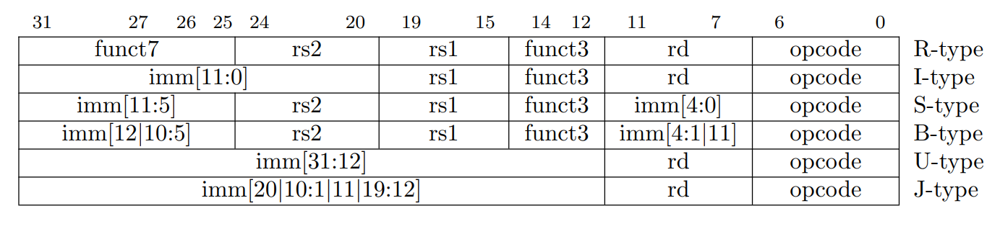
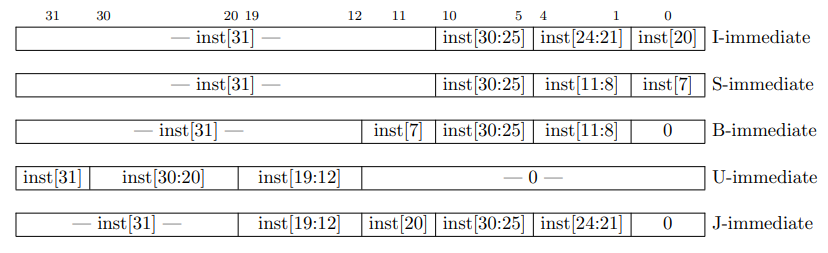

# Instrukce
## 32-bit RISC-V instruction set

## RV32i
Jak vypadá instrukce?

ISA RV32I specifikuje čtyři základní instrukční formáty (R/I/S/U), tabulka. Všechny instrukce mají fixní délku 32 bitů a musí být zarovnány na 4 bajty. 
Pokud při skocích v programu adresa následující instrukce není zarovnána na 4 bajty, IALIGN=32 (bitů), je generovaná výjimka "instruction-address-misaligned".
Při dódování instrukce jejíž opcode nedává smysl je vyvolána výjimka "illegal-instruction".

Termín IALIGN (měřeno v bitech) používáme k odkazu na omezení zarovnání instrukce adresy, které implementace vynucuje. IALIGN je 32 bitů v základním ISA.

Z tabulky je dále patrné, že instrukce ihned (immediet) se vykonávají s jedním registrem (rs) a hodnotou uloženou přímo v kódu programu (konstantou), výsledek se uloží do cílového registru (rd). Naproti tomu registrové instrukce mají dva operandy uložené ve zdrojových registrech rs1 a rs2, výsledek operace se opět ukládá do registru (rd).
Pozice operandů rs1, rs2 a rd se napříč formáty neliší, což umožňuje jednoduché dekódování instrukcí.

Immidieate operandy jsou vždy nejprve znaménkově rozšířeny na délku 32bitů. V tabulce je imm argument uveden s rozsahem bitů v hranatých závorkách. Například imm[11:0] znamená, že se jedná o 12 bitovou hodnotu, která je znaménkově rozšířena na 32 bitů.
Znaménkové rozšíření je jedna z nejdůležitějších operací na okamžitých instrukcích. V RISC-V je znaménkový bit pro všechny okamžité hodnoty vždy uložen v 31 bitu instrukce, aby znaménkové rozšíření mohlo probíhat paralelně s dekódováním instrukce.

### Immidiate instrukce

Jediný rozdíl mezi formáty S a B je v tom, že 12bitové okamžité pole bitů se používá k zakódování větvení v násobcích 2 v B formátu. Místo toho, aby se všechny bity v okamžitém kódování instrukce posunuly vlevo o jeden bit v hardwaru, jak je obvyklé, zůstávají střední bity (imm[10:1]) a znaménkový bit na pevných pozicích, zatímco nejnižší bit ve formátu S (inst[7]) kóduje bit vyššího řádu ve formátu B.

Podobně jediný rozdíl mezi formáty U a J je v tom, že 20bitové okamžité pole bitů se posune vlevo o 12 bitů, aby vytvořilo okamžité U a o 1 bit, aby vytvořilo okamžité J. Umístění instrukčních bitů v okamžitých U a J formátech je vybráno tak, aby se maximalizoval překryv s ostatními formáty a mezi sebou.

Tabulka  ukazuje okamžité hodnoty vyrobené každým základním instrukčním formátem a je označena tak, aby ukázala, který bit instrukce (inst[y]) produkuje jaký bit okamžité hodnoty. Například okamžitá hodnota pro formát I je vytvořena z inst[31:20], zatímco okamžitá hodnota pro formát S je vytvořena z inst[31:25] a inst[11:7].

## Zdroje
PDF strana 34, jak skládat operand immidiate v jednotlivých typech instrukcí.  
- [wiki](https://en.wikipedia.org/wiki/RISC-V)