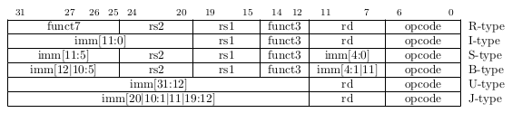
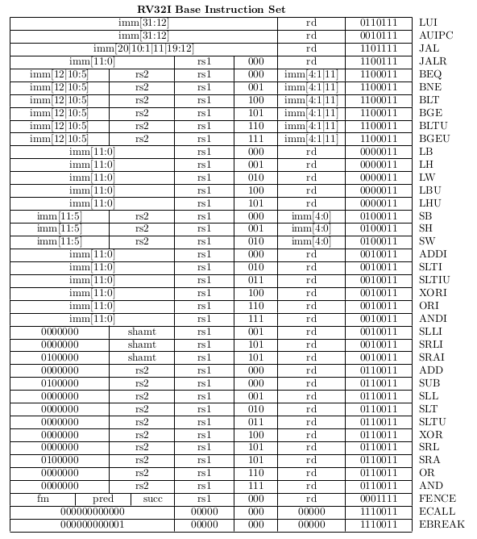

# Programování RISC-V

## Instrukční sada
#### Typy instrukcí


#### Instrukce
```
LUI, AUIPC, JAL, JALR, BEQ, BNE, BLT, BGE, BLTU, BGEU, LB, LH, LW, LBU, LHU, SB, SH, SW, ADDI, SLTI, SLTIU, XORI, ORI, ANDI, SLLI, SRLI, SRAI, ADDR, SUBR, SLLR, SLTR, SLTRU, XORR, SRLR, SRAR, ORR, ANDR, FENCE, ECALL, EBREAK
```

PDF: 148

## Pseudoinstrukce
Pseudoinstrukce slouží pro větší abstrakci při programování v jazyku symbolických adres (assembly). Umožňují psát program v instrukcích, které procesor sice přímo nepodporuje, ale jejich vykonání je možné syntetizovat pomocí již existujících instrukcí a to buď zaměněním pořadí argumentů, či případně vynulováním jednoho z nich. 
Například instrukce NOP (nedělej nic) lze syntetizovat jako ADDI x0, x0, 0, nebo instrukce MV (přesun obsah registru) jako ADDI rd, ra1, 0. V tabulce je přehled dalších pseudoinstrukcí. 

## Zápis instrukcí v ASM
Instrukce se skládá z názvu instrukce a argumentů. Argumenty jsou odděleny čárkou a mohou být v závorce. Argumenty mohou být registry, konstanty, nebo adresy. 
```assembly
inst rd, rs1, rs2
inst rd, rs1, imm
jmp rd, imm
```
Pořadí argumentů je následující: cílový registr, první zdrojový registr, druhý zdrojový registr. Pokud je v instrukci pouze jeden registr, tak je to cílový registr. 

## Inicializace procesoru
Procesor je potřeba před spuštěním vyresetovat. To smaže obsah všech registrů a shodí všechny případné výjimky. Pokud náš program pracuje se zásobník, tak je potřeba nejprve provést inicializaci registru *x2*, sp - stack pointeru na horní hranici rozsahu paměti RAM. Operační paměť má nastavenou syntetizovanou velikost 4kB (4096 bajtů).
```assembly
# MEM(0:4092)
# WORD_SIZE = 4
li sp, 4096
addi sp, sp, -4 
```

## Volání funkcí
Volání funkcí v jazyce symbolických adres. *func* je zde symbol (název funkce) a používá se jako reference na adresu následující instrukce.
Příkaz *jal* (jump and link) provede skok na adresu funkce a uloží si do registru *ra* adresu následující instrukce. Tento registr se používá pro návrat z funkce. Příkaz *ret* (return) provede skok na adresu uloženou v registru *ra*. Jako registry argumentů se standardně používají registry *a0* až *a7*. Pro uložení návratových hodnot slouží registry *a0* a *a1*.
```assembly
func:
    # tělo funkce
    ret

jal ra, func
```

## Začínáme ve funkci main
Skok na hlavní hlavní program. Příkaz *j* (jump) provede skok na adresu funkce (main). Je možné, že náš program po inicializaci obsahuje deklarace funkcí, které chceme při spuštění přeskočit. 
```assembly
j main
```


## Program v Assembly
Takto by mohl vypadat demonstrační program, který běží v nekonečné smyčce. Funkce return_arg vrací svůj argument. Program main, volá funkci return_arg a její návratovou hodnotu ukládá do registru *a0*. Pokud je návratová hodnota různá od nuly, tak se program vrátí na začátek smyčky. Pokud je návratová hodnota nula, tak se program ukončí vyvoláním výjimky ecall.
```assembly
.text
.globl main

li sp, 4096
addi sp, sp, -4

j main

# Funkce return argumet
# Argumenty:
#  a0 - argument
#  a1 - navratova hodnota
return_arg:
    mv a1, a0   # a1 = a0
    li a0, 0    # a0 = 0
    ret

main:
    addi a0, x0, 1  # a0 = 1

    loop:
        jal ra, return_arg  # a1 = return_arg(a0)
        addi a0, a1, 0      # a0 = a1
        bne a1, x0, loop    # if a1 is True goto loop
	
    ecall
```
Direktiva *.text* říká, že následující instrukce jsou instrukce programu a budou uložena v sekci paměti text. Direktiva *.globl* říká, že následující symbol je globální a může být použit v jiných souborech. V tomto případě je to symbol *main*.