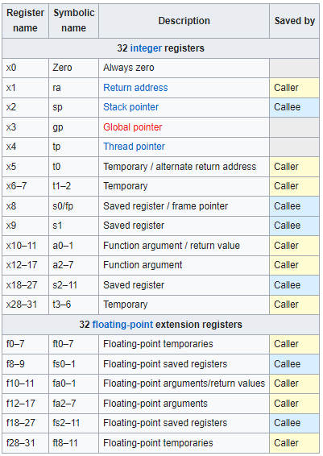

# Registry procesoru
V tabulce jsou popsány všechny adresovatelné registry základní neprivilegované ISA. Architektura RV32I má 32 celočíselných registrů, každý 32 bitů široký, tedy XLEN=32. Registr x0 je pevně zapojen všemi svými bity na 0. Obecné registry x1–x31 obsahují hodnoty, které různé instrukce interpretují jako:
- kolekci booleovských hodnot, nebo jako 
- dvojkový doplněk (znaménková binární celá čísla) 
- neznaménková binární celá čísla.
ISA specifikuje ještě jeden registr pc, který obsahuje adresu aktuální instrukce, zobrazený v tabulce.

Délka registru: XLEN=32b.
x1 - návratová adresa z funkce, alternativně x5  
x2 - stack pointer

## Slovníček
| anglicky | česky |
|---|---|
| register | registr |
| caller | volající |
| callee | volaný |

## Tabulka
|Register name|Symbolic name|Description|Saved by|
|---|---|---|---|
| x0 | Zero | Always zero | 
| x1 | ra | Return address | Caller |
| x2 | sp | Stack pointer | Callee |
| x3 | gp | Global pointer |
| x4 | tp | Thread pointer |
| x5 | t0 | Temporary / alternate return address | Caller |
| x6–7 | t1–2 | Temporary | Caller |
| x8 | s0/fp | Saved register / frame pointer | Callee | 
| x9 | s1 | Saved register | Callee |
| x10–11 | a0–1 | Function argument / return value | Caller |
| x12–17 | a2–7 | Function argument | Caller |
| x18–27 | s2–11 | Saved register | Callee |
| x28–31 | t3–6 | Temporary | Caller |

## Obrázek

## Zdroje:
https://en.wikipedia.org/wiki/RISC-V