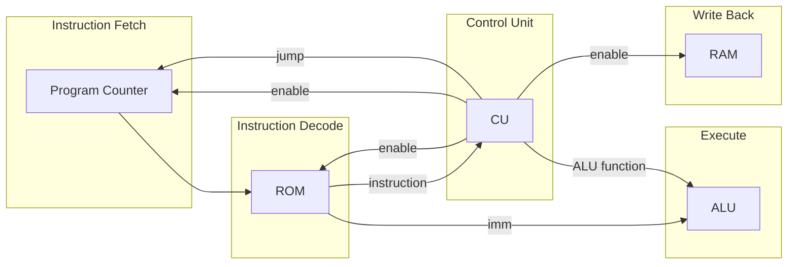
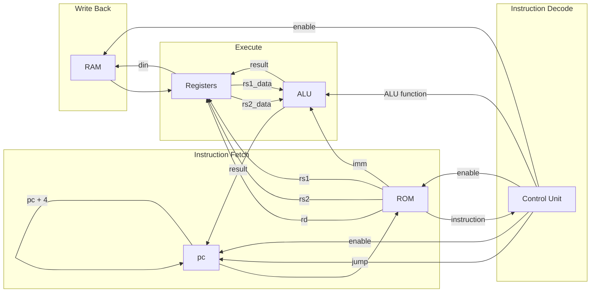
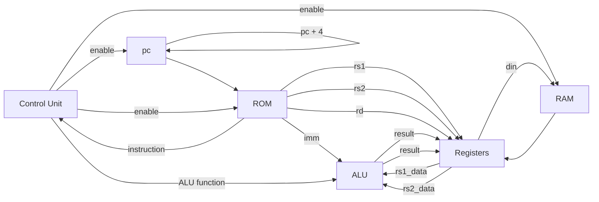

```mermaid
graph LR
    subgraph Instruction Fetch
        PC[Program Counter]
    end

    subgraph Instruction Decode
        PC --> ROM
        ROM[ROM]
    end
    
    subgraph Execute
        ALU
        ROM --> |imm| ALU
    end

    subgraph Write Back
        RAM[RAM]
    end

    subgraph Control Unit
    
        ROM --> |instruction| CU
        CU --> |enable| ROM
        CU --> |enable| RAM
        CU --> |enable| PC
        CU --> |jump| PC
        CU --> |ALU function| ALU
    end

```

```mermaid
graph RL
    CU[Control Unit]
    reg[Registers]

    subgraph Instruction Fetch
        pc --> ROM
        pc --> |pc + 4| pc
    end
    
    subgraph Instruction Decode
        CU --> |enable| ROM
        CU --> |enable| pc
        CU --> |jump| pc
        ROM --> |instruction| CU
    end

    subgraph Execute
        ROM --> |imm| ALU
        CU --> |ALU function| ALU
        reg --> |rs1_data| ALU
        reg --> |rs2_data| ALU
    end
    
    subgraph Write Back
        CU --> |enable| RAM
        RAM --> reg
        reg --> |din| RAM
        ALU --> |result| pc
        ALU --> |result| reg
        ROM --> |rs1| reg
        ROM --> |rs2| reg
        ROM --> |rd| reg
    end
    
```

```mermaid
graph LR
    CU[Control Unit]
    reg[Registers]

    pc --> ROM
    pc --> |pc + 4| pc

    ROM --> |instruction| CU
    ROM --> |imm| ALU
    ROM --> |rs1| reg
    ROM --> |rs2| reg
    ROM --> |rd| reg

    CU --> |enable| pc
    CU --> |enable| ROM
    CU --> |ALU function| ALU
    CU --> |enable| RAM

    reg --> |rs1_data| ALU
    reg --> |rs2_data| ALU


    ALU --> |result| reg
    ALU --> |result| reg
    RAM --> reg
    reg --> |din| RAM
    
```